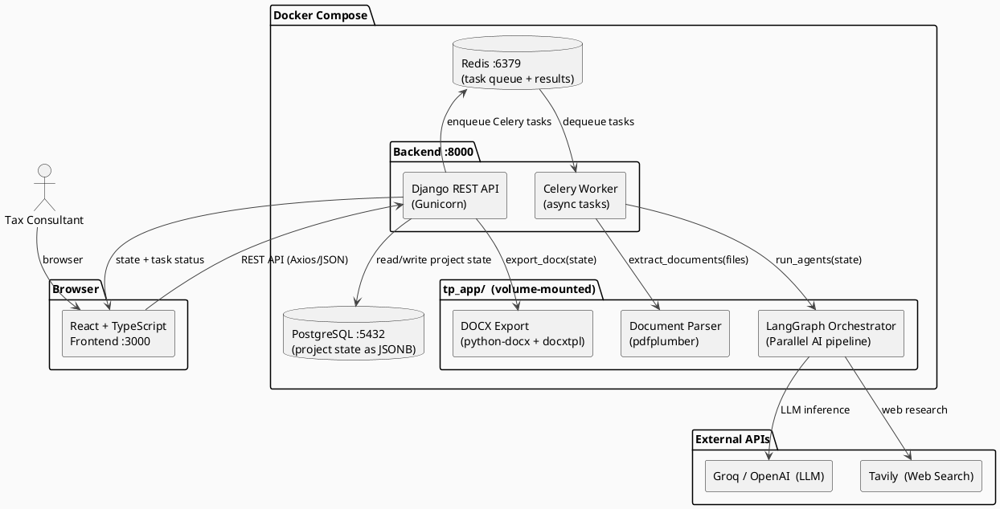
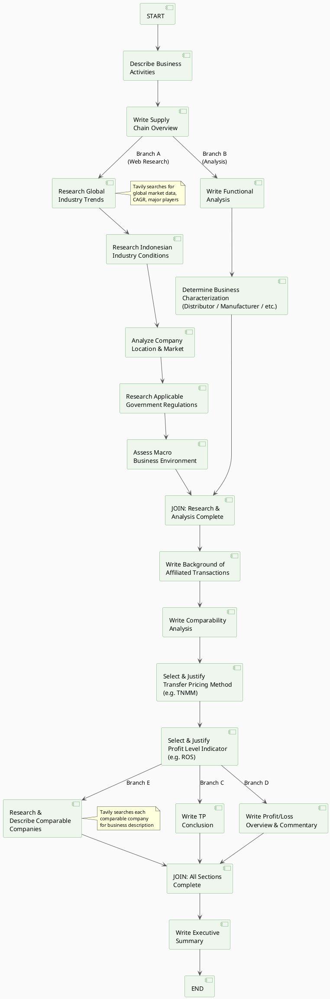

# TP Local File Generator

## Introduction

### What is this application?

**TP Local File Generator** is an AI-powered web application that automates the creation of Transfer Pricing (TP) Local File documentation — a mandatory compliance report required by Indonesian tax regulations (PMK-213/2016) for companies conducting affiliated transactions above the threshold.

A TP Local File is a complex, multi-chapter document that requires:
- Detailed company and ownership information
- Industry and economic environment analysis
- Functional analysis (functions, assets, risks)
- Comparability analysis with benchmark companies
- Transfer pricing method selection and justification
- Profit/loss overview and executive summary

Traditionally, a tax consultant spends **weeks** manually researching, writing, and formatting this document. This application reduces that to **hours** by combining a structured data-entry wizard with an AI agent pipeline that researches, writes, and formats each section automatically — then exports the result as a ready-to-use DOCX file.

### Why we built this

Indonesian TP Local File requirements are highly standardized in structure but deeply specific in content — every company has a different industry, transaction type, affiliate network, and financials. This makes it an ideal candidate for AI-assisted documentation: the skeleton is fixed, but the content must be researched and written fresh for each engagement.

Key pain points we solve:

- **Manual research burden**: Industry analysis, regulation research, and comparable company profiling require hours of web research per engagement. The AI agents handle this automatically using Tavily web search.
- **Writing consistency**: LLM-generated sections follow the formal transfer pricing documentation style required by the DGT (Directorate General of Taxation).
- **Template compliance**: The DOCX output follows the exact structure required for regulatory submission, using a pre-approved template with proper headings, tables, and formatting.
- **Multi-project management**: Consultants handle many clients simultaneously. The project dashboard allows managing multiple TP Local Files in one place with persistent state.

---

## Architecture

### System Design Diagram (PlantUML)



> Paste the block above into [plantuml.com/plantuml](https://www.plantuml.com/plantuml/uml/) or use the PlantUML VS Code extension to render the diagram.

### AI Agent Pipeline (LangGraph parallel graph)



---

### Why this system design?

**1. Decoupled frontend and backend (React + Django REST)**

The wizard UI requires frequent partial saves, live validation, and multi-step navigation — all things that benefit from a rich client-side state. Zustand manages the in-memory wizard state and syncs to the backend on each step navigation. Django provides a clean REST API that is also accessible for future integrations (CLI, batch export, or third-party tools).

**2. Project state stored as JSONB in PostgreSQL**

The TP Local File state is a deeply nested, schema-evolving document (dozens of fields, nested lists, optional sections). Storing it as a JSONB column in PostgreSQL gives full SQL queryability without requiring schema migrations every time a new field is added. It also makes import/export trivial — the JSON is the state.

**3. Celery + Redis for async AI tasks**

AI agent pipelines take 2–5 minutes to complete (multiple LLM calls + Tavily searches). Blocking the HTTP request for that duration is not acceptable. Celery offloads these to background workers while the frontend polls for progress via `/api/tasks/{id}/`. Redis serves as both the message broker and result backend, keeping the architecture simple with a single additional service.

**4. LangGraph for parallel AI orchestration**

Each section of the TP Local File is independent where dependencies allow. LangGraph's `StateGraph` makes this explicit: research branches (industry analysis, regulations, business environment) run in parallel with the functional analysis branch, then join at a sync node before the transaction sections are written. Branches C/D/E (conclusion, P/L overview, comparable research) also run in parallel at the end. This reduces total generation time by ~60% compared to sequential execution.

**5. tp_app/ as a volume-mounted module**

The AI agent logic, DOCX templates, and export code live in `tp_app/` which is volume-mounted into both the backend and Celery worker containers. This means agent code can be edited and tested without rebuilding Docker images — a significant time-saver during development. The same module was the original Streamlit prototype, ensuring continuity between the old and new interface.

**6. Two DOCX export paths (python-docx + docxtpl)**

- `type=builder` — builds the document programmatically using `python-docx`. Full control over structure and style, but verbose to maintain.
- `type=template` — renders a pre-formatted Word template (`TP_Local_File_TEMPLATE.docx`) using `docxtpl` (Jinja2 over DOCX XML). Preferred for production because the template can be edited by non-developers directly in Microsoft Word without touching Python code.

Both paths read the same project state. Switching between them requires only a query parameter change.

---

## Tech Stack

### Frontend

| Technology | Version | Purpose |
|------------|---------|---------|
| [React](https://react.dev/) | 18 | UI framework — component-based wizard interface |
| [TypeScript](https://www.typescriptlang.org/) | 5 | Type safety across all UI components and API contracts |
| [Vite](https://vitejs.dev/) | 5 | Dev server and production bundler |
| [Tailwind CSS](https://tailwindcss.com/) | 3 | Utility-first styling, responsive layout |
| [Zustand](https://zustand-demo.pmnd.rs/) | 4 | Lightweight global state management (wizard state, API settings) |
| [Axios](https://axios-http.com/) | 1 | HTTP client for REST API calls |
| [Lucide React](https://lucide.dev/) | latest | Icon set |

### Backend

| Technology | Version | Purpose |
|------------|---------|---------|
| [Python](https://www.python.org/) | 3.12 | Primary backend language |
| [Django](https://www.djangoproject.com/) | 5 | Web framework — URL routing, ORM, admin |
| [Django REST Framework](https://www.django-rest-framework.org/) | 3 | REST API serializers, views, authentication |
| [Celery](https://docs.celeryq.dev/) | 5 | Distributed async task queue for AI pipeline execution |
| [Gunicorn](https://gunicorn.org/) | latest | WSGI production server |
| [psycopg2](https://www.psycopg.org/) | 2 | PostgreSQL adapter |

### AI & Agents

| Technology | Version | Purpose |
|------------|---------|---------|
| [LangGraph](https://langchain-ai.github.io/langgraph/) | latest | Stateful parallel AI agent orchestration |
| [LangChain](https://www.langchain.com/) | latest | LLM abstraction, prompt management |
| [Groq](https://groq.com/) | API | Ultra-fast LLM inference (default: `llama-3.3-70b-versatile`) |
| [OpenAI](https://openai.com/) | API | Alternative LLM provider (GPT-4o etc.) |
| [Tavily](https://tavily.com/) | API | AI-optimized web search for industry & regulation research |

### Document Processing

| Technology | Purpose |
|------------|---------|
| [python-docx](https://python-docx.readthedocs.io/) | Programmatic DOCX generation (builder export path) |
| [docxtpl](https://docxtpl.readthedocs.io/) | Jinja2 templating over Word DOCX files (template export path) |
| [pdfplumber](https://github.com/jsvine/pdfplumber) | PDF text extraction for document upload feature |

### Infrastructure

| Technology | Purpose |
|------------|---------|
| [PostgreSQL](https://www.postgresql.org/) 15 | Primary database — project state stored as JSONB |
| [Redis](https://redis.io/) 7 | Celery message broker and task result backend |
| [Docker](https://www.docker.com/) + [Docker Compose](https://docs.docker.com/compose/) | Container orchestration for all services |
| [uv](https://github.com/astral-sh/uv) | Fast Python package manager for the agent module |

---

## Quick Start

### Prerequisites

- Docker & Docker Compose
- Groq or OpenAI API key
- Tavily API key (required for AI web research sections)

### 1. Clone and start

```bash
git clone <repo-url>
cd tp_local_file_generator
docker compose up --build
```

### 2. Open the app

| Service | URL |
|---------|-----|
| Frontend | http://localhost:3000 |
| Django API | http://localhost:8000/api/ |
| Django Admin | http://localhost:8000/admin/ |

### 3. Configure API keys

Click the **Settings** icon in the sidebar to enter:
- **LLM Provider**: Groq (recommended, free tier available) or OpenAI
- **LLM API Key**
- **Tavily API Key** (required for industry research, regulations, comparable company descriptions)

---

## User Flow

```
1. Project Dashboard  →  Create a new project or open an existing one
2. Step 0: Upload     →  (Optional) Upload prior TP docs for AI data extraction
3. Steps 1–9: Wizard  →  Fill in company info, ownership, financials, transactions, comparables
4. Step 10: AI Agents →  Run the full AI pipeline (~5–10 min)
                          Review and edit each generated section inline
5. Export             →  Download  TP_{Company Name}_FY{Year}.docx
```

---

## Directory Structure

```
tp_local_file_generator/
├── tp_app/                         ← AI agents, DOCX export, templates
│   ├── agents/
│   │   ├── orchestrator.py         ← LangGraph StateGraph (parallel pipeline)
│   │   ├── research_subagent.py    ← Tavily web research nodes
│   │   ├── analysis_subagent.py    ← Functional analysis + characterization
│   │   ├── transaction_subagent.py ← Background, comparability, method, PLI
│   │   ├── summary_subagent.py     ← Conclusion, P/L overview, exec summary
│   │   └── business_subagent.py    ← Business activities, supply chain
│   ├── export/
│   │   ├── docx_export.py          ← python-docx builder (type=builder)
│   │   └── docx_template_export.py ← docxtpl Jinja2 renderer (type=template)
│   ├── TP_Local_File_TEMPLATE.docx ← Jinja2 Word template (edit in Word)
│   └── utils/
│       ├── dummy_data.py           ← Sample dataset for testing
│       └── doc_parser.py           ← PDF/DOCX extraction utilities
├── backend/                        ← Django REST API
│   ├── config/                     ← Settings, URLs, Celery config
│   ├── api/
│   │   ├── models.py               ← Project model (state as JSONB)
│   │   ├── views.py                ← API endpoints + DOCX export
│   │   ├── tasks.py                ← Celery async tasks
│   │   └── services/
│   │       └── agent_service.py    ← Django ↔ LangGraph bridge
│   └── Dockerfile
├── frontend/                       ← React + TypeScript + Tailwind CSS
│   ├── src/
│   │   ├── pages/                  ← ProjectDashboard, Step0–Step10
│   │   ├── components/             ← Sidebar, SettingsModal, DynamicTable, etc.
│   │   ├── store/                  ← Zustand project store + API settings
│   │   ├── types/                  ← TypeScript interfaces
│   │   └── api/                    ← Axios API client
│   └── Dockerfile
├── docker-compose.yml
└── .env
```

---

## API Reference

| Method | Endpoint | Description |
|--------|----------|-------------|
| GET | `/api/config/` | TP methods, PLI options, transaction types |
| POST | `/api/projects/` | Create new project |
| GET | `/api/projects/` | List all projects |
| GET | `/api/projects/{id}/` | Get full project state |
| PATCH | `/api/projects/{id}/` | Save state updates |
| DELETE | `/api/projects/{id}/` | Delete project |
| GET | `/api/projects/{id}/export-json/` | Download project as JSON backup |
| POST | `/api/projects/{id}/load-json/` | Restore from JSON backup |
| POST | `/api/projects/{id}/upload-documents/` | Upload + AI extract (async) |
| POST | `/api/projects/{id}/run-agents/` | Run full AI pipeline (async) |
| POST | `/api/projects/{id}/run-single-agent/` | Regenerate one section (async) |
| GET | `/api/tasks/{task_id}/` | Poll Celery task status + progress log |
| GET | `/api/projects/{id}/export-docx/?type=template` | Download DOCX (docxtpl) |
| GET | `/api/projects/{id}/export-docx/?type=builder` | Download DOCX (python-docx) |

---

## Development

### Backend only (without Docker)

```bash
cd backend
pip install -r requirements.txt
python manage.py migrate
python manage.py runserver
# In another terminal:
celery -A config worker --loglevel=info
```

### Frontend only (without Docker)

```bash
cd frontend
npm install
npm run dev
```

Update `frontend/vite.config.ts` proxy target to `http://localhost:8000` when running outside Docker.

### Test AI agents only (no web UI)

```bash
cd tp_app
uv run python -c "
from utils.dummy_data import DUMMY_STATE
from agents.orchestrator import run_agents
result = run_agents(DUMMY_STATE)
print(result.get('executive_summary', ''))
"
```
