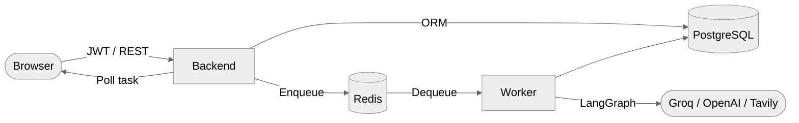
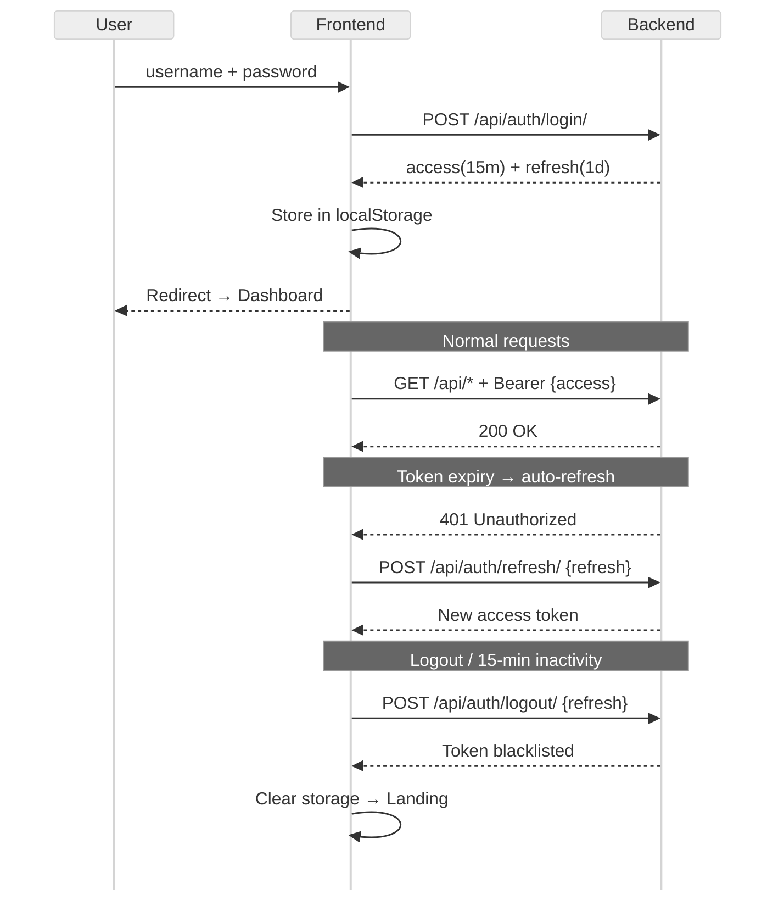
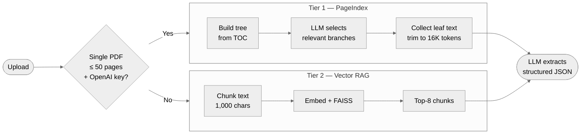
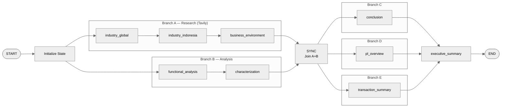
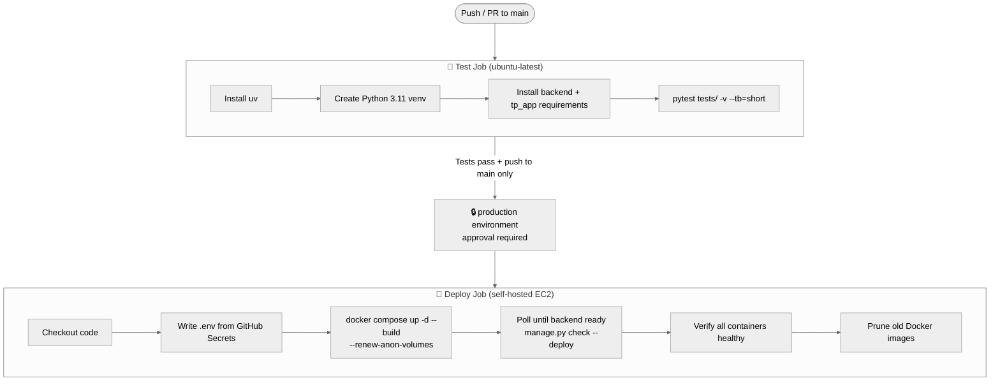

# TP Local File Generator

AI-powered web application that automates the creation of **Transfer Pricing (TP) Local File** documentation — a mandatory compliance report required by Indonesian tax regulations (PMK-213/2016) for companies conducting affiliated transactions above the threshold.

Traditionally a tax consultant spends **weeks** manually researching, writing, and formatting this document. This application reduces that to **hours** by combining a structured data-entry wizard with an AI agent pipeline that researches, writes, and formats each section automatically — then exports the result as a ready-to-use `.docx` file.

---

## Why "TP Local File"?

> For developers unfamiliar with Indonesian tax regulations, the name may seem unusual. Here is the context.

**Transfer Pricing (TP)** refers to the pricing of transactions between related parties (affiliates) — for example, between a parent company and its subsidiaries, or between sister companies within the same multinational group.

Under **PMK-213/2016** (Indonesian Ministry of Finance Regulation), Indonesian companies that conduct affiliated transactions above a certain threshold are **legally required** to prepare three transfer pricing documents:

| # | Document | Indonesian Name | Contents |
|---|----------|----------------|----------|
| 1 | **Master File** | Dokumen Induk | Overview of the multinational group: global structure, business, and group-wide TP policies |
| 2 | **Local File** | Dokumen Lokal | Details of the Indonesian entity's affiliated transactions: functional analysis, TP method, financial data |
| 3 | **CbCR** | Laporan per Negara | Aggregated financial data by country (only for groups with revenue > IDR 11 trillion) |

**This application specifically generates document #2 — the Local File (Dokumen Lokal).** That is why it is called "TP Local File Generator".

The name was chosen deliberately so that tax consultants — the primary users — immediately understand which document the tool produces, without ambiguity.

---

## Table of Contents

- [Architecture Overview](#architecture-overview)
- [Tech Stack](#tech-stack)
- [Quick Start](#quick-start)
- [Environment Variables](#environment-variables)
- [Directory Structure](#directory-structure)
- [User Flow](#user-flow)
- [Login & Authentication Flow](#login--authentication-flow)
- [Document Retrieval: PageIndex Algorithm](#document-retrieval-pageindex-algorithm)
- [AI Agent Pipeline](#ai-agent-pipeline)
- [API Reference](#api-reference)
- [CLAUDE.md — AI Assistant Instructions](#claudemd--ai-assistant-instructions)
- [Graphify — Codebase Knowledge Graph](#graphify--codebase-knowledge-graph)
- [Development Guide](#development-guide)
- [Deployment](#deployment)
- [Next Development Suggestions](#next-development-suggestions)

---

## Architecture Overview


```mermaid
%%{init: {"theme": "neutral", "themeVariables": {"fontSize": "18px"}, "flowchart": {"nodeSpacing": 60, "rankSpacing": 80}}}%%
graph LR
    Browser([Browser]) -->|JWT / REST| Backend
    Backend -->|ORM| DB[(PostgreSQL)]
    Backend -->|Enqueue| Redis[(Redis)]
    Redis -->|Dequeue| Worker
    Worker -->|LangGraph| AI([Groq / OpenAI / Tavily])
    Worker --> DB
    Backend -->|Poll task| Browser
```

### Services

| Service    | Image              | Port | Purpose                           |
|------------|--------------------|------|-----------------------------------|
| `db`       | postgres:16-alpine | 5432 | Primary database                  |
| `redis`    | redis:7-alpine     | 6379 | Celery broker & result backend    |
| `backend`  | Python 3.11-slim   | 8000 | Django REST API (Gunicorn)        |
| `worker`   | Python 3.11-slim   | —    | Celery async worker (AI tasks)    |
| `frontend` | Node 20-alpine     | 3000 | React dev server (Vite)           |

### Why this design?

**JSONB state storage** — The TP Local File state is a deeply nested, schema-evolving document. Storing it as a JSONB column avoids schema migrations every time a new field is added, and makes import/export trivial.

**Celery + Redis for async AI tasks** — LLM pipelines take 2–5 minutes. Celery offloads these to background workers while the frontend polls `/api/tasks/{id}/` for live progress.

**Volume-mounted `tp_app/`** — Agent code, templates, and export logic are mounted into both the backend and worker containers. Code edits take effect without rebuilding Docker images during development.

**LangGraph parallel orchestration** — Independent TP sections run in parallel branches, reducing total generation time by ~60% vs. sequential execution.

---

## Tech Stack

### Frontend

| Technology         | Version | Purpose                                       |
|--------------------|---------|-----------------------------------------------|
| React              | 18      | Component-based wizard UI                     |
| TypeScript         | 5       | Type safety across components & API contracts |
| Vite               | 5       | Dev server and production bundler             |
| Tailwind CSS       | 3       | Utility-first styling                         |
| Zustand            | 5       | Global state (wizard data, auth, settings)    |
| React Router DOM   | 6       | Client-side routing                           |
| TanStack Query     | 5       | Server state caching & background refetch     |
| Axios              | 1       | HTTP client for REST API calls                |
| React Dropzone     | 14      | Drag-and-drop file upload                     |
| Radix UI           | latest  | Accessible headless UI primitives             |

### Backend

| Technology                    | Version | Purpose                             |
|-------------------------------|---------|-------------------------------------|
| Python                        | 3.11    | Primary language                    |
| Django                        | 5.0.6   | Web framework, ORM, admin           |
| Django REST Framework         | 3.15.2  | REST API serializers & views        |
| djangorestframework-simplejwt | 5.3.1   | JWT authentication                  |
| Celery                        | 5.4.0   | Async task queue                    |
| Redis / kombu                 | 5.0.8   | Message broker for Celery           |
| psycopg2-binary               | 2.9.9   | PostgreSQL adapter                  |
| Gunicorn                      | 22.0.0  | WSGI production server              |
| WhiteNoise                    | 6.7.0   | Static file serving                 |
| python-docx                   | 1.1.2   | Programmatic DOCX generation        |
| docxtpl                       | 0.18.0  | Jinja2 templating over Word files   |

### AI & Agents (`tp_app/`)

| Technology            | Purpose                                          |
|-----------------------|--------------------------------------------------|
| LangGraph             | Stateful parallel AI agent orchestration         |
| LangChain             | LLM abstraction, prompt management               |
| Groq (default)        | Fast LLM inference (`llama-3.3-70b-versatile`)   |
| OpenAI (optional)     | Alternative LLM provider (GPT-4o etc.)           |
| Tavily                | AI-optimized web search for industry research    |
| PageIndex             | Vectorless hierarchical PDF retrieval            |
| FAISS                 | In-memory vector store (Vector RAG fallback)     |
| sentence-transformers | HuggingFace local embeddings (free)              |
| PyPDF2 / pymupdf      | PDF parsing                                      |
| tiktoken              | Token counting                                   |

---

## Quick Start

### Prerequisites

| Tool | Version | Install |
|------|---------|---------|
| Docker & Docker Compose | latest | https://docs.docker.com/get-docker/ |
| Python | ≥ 3.11 | https://www.python.org/downloads/ |
| Node.js | ≥ 20 | https://nodejs.org/ |
| uv | latest | see below |
| Git | latest | https://git-scm.com/ |

Plus at least one API key from each:
- **LLM**: Groq (free tier) or OpenAI
- **Web search**: Tavily

---

### API Keys — How to Get Them

#### Groq (recommended — free tier, no credit card required)

1. Go to [https://console.groq.com](https://console.groq.com)
2. Click **Sign Up** — register with Google or email
3. After login, go to **API Keys** in the left sidebar
4. Click **Create API Key** → give it a name (e.g. `tp-app`)
5. Copy the key — it starts with `gsk_...`
6. Paste it into **Admin Settings** in the app (not `.env`)

> Free tier includes generous rate limits sufficient for development and light production use.

---

#### OpenAI (optional, paid)

1. Go to [https://platform.openai.com](https://platform.openai.com)
2. Click **Sign Up** or **Log In**
3. Go to **API Keys** → [https://platform.openai.com/api-keys](https://platform.openai.com/api-keys)
4. Click **Create new secret key** → give it a name
5. Copy the key — it starts with `sk-...`
6. Make sure your account has **billing enabled** (add a credit card under Billing)
7. Paste it into **Admin Settings** in the app

> Recommended model: `gpt-4o-mini` for cost efficiency, `gpt-4o` for higher quality.

---

#### Tavily (required for AI research sections)

Tavily is used by the AI agents to search the web for industry analysis, Indonesian regulations, and comparable company data.

1. Go to [https://app.tavily.com](https://app.tavily.com)
2. Click **Sign Up** — register with Google or email
3. After login, your API key is shown on the **dashboard** immediately
4. Copy the key — it starts with `tvly-...`
5. Paste it into **Admin Settings** in the app

> Free tier includes 1,000 searches/month. Each full AI pipeline run uses approximately 5–15 Tavily searches.

---

### Step 1 — Install `uv` (Python package manager)

`uv` is required to manage all Python dependencies in this project. Install it once globally:

**macOS / Linux:**
```bash
curl -LsSf https://astral.sh/uv/install.sh | sh
```

**Windows (PowerShell):**
```powershell
powershell -ExecutionPolicy ByPass -c "irm https://astral.sh/uv/install.ps1 | iex"
```

Verify:
```bash
uv --version
```

---

### Step 2 — Clone the repository

```bash
git clone <repo-url>
cd tp_local_file_generator
```

---

### Step 3 — Configure environment variables

```bash
cp .env.example .env
```

Open `.env` and fill in the required values (see [Environment Variables](#environment-variables) section for reference). At minimum set `SECRET_KEY`, `POSTGRES_PASSWORD`.

---

### Step 4 — Install Python dependencies (tp_app)

`tp_app/` is the AI agent module. Install its dependencies with `uv`:

```bash
cd tp_app
uv sync
cd ..
```

This reads `tp_app/pyproject.toml` and installs everything into an isolated `.venv` inside `tp_app/`.

---

### Step 5 — Install frontend dependencies

```bash
cd frontend
npm install
cd ..
```

---

### Step 6 — Build and start all services

```bash
docker compose up --build
```

This builds and starts: `db` (PostgreSQL), `redis`, `backend` (Django), `worker` (Celery), `frontend` (React/Vite).

> First build takes ~3–5 minutes. Subsequent starts with `docker compose up -d` are fast.

---

### Step 7 — Run database migrations & create superuser (first time only)

Wait for the backend to be healthy (watch logs with `docker compose logs -f backend`), then:

```bash
docker compose exec backend python manage.py migrate
docker compose exec backend python manage.py createsuperuser
```

---

### Step 8 — Open the app

| Service        | URL                          |
|----------------|------------------------------|
| Frontend (app) | http://localhost:3000        |
| Django API     | http://localhost:8000/api/   |
| Django Admin   | http://localhost:8000/admin/ |

---

### Step 9 — Configure API keys

Log in as the superuser you just created → **Admin Settings** → enter:
- LLM Provider (Groq or OpenAI)
- LLM API Key
- Tavily API Key

These are stored in the database and shared across all users — no need to put them in `.env`.

---

### Quick reference (after initial setup)

```bash
# Start all services (background)
docker compose up -d

# Stop all services
docker compose down

# Rebuild after code changes
docker compose up -d --build backend worker

# View backend logs
docker compose logs -f backend

# View worker (AI agent) logs
docker compose logs -f worker

# Run Django management commands
docker compose exec backend python manage.py <command>
```

---

## Environment Variables

Create `.env` at the project root (copy from `.env.example`):

```env
# ── Django ─────────────────────────────────────────────────────
SECRET_KEY=change-me-to-a-long-random-string
DEBUG=True
ALLOWED_HOSTS=*

# ── PostgreSQL ─────────────────────────────────────────────────
POSTGRES_DB=tp_db
POSTGRES_USER=tp_user
POSTGRES_PASSWORD=tp_pass

# ── Redis (Celery) ─────────────────────────────────────────────
REDIS_URL=redis://redis:6379/0
```

> **LLM and Tavily API keys are stored in the database**, not in `.env`. Configure them from the Admin Settings page after first login.

---

## Directory Structure

```
tp_local_file_generator/
│
├── frontend/                        React + TypeScript + Vite
│   └── src/
│       ├── pages/                   LandingPage, LoginPage, ProjectDashboard,
│       │                            Step0Upload … Step11ReviewExport
│       ├── components/              Sidebar, SettingsModal, DynamicTable, etc.
│       ├── store/                   Zustand: projectStore, authStore
│       ├── api/                     Axios client (projects, auth, tasks)
│       └── types/                   TypeScript interfaces
│
├── backend/                         Django REST API
│   ├── config/                      settings.py, urls.py, celery.py, wsgi.py
│   └── api/
│       ├── models.py                Project (JSONB), AgentTask, SystemSetting
│       ├── views.py                 All API endpoints
│       ├── tasks.py                 Celery async tasks
│       ├── serializers.py
│       └── services/
│           └── agent_service.py     Django ↔ LangGraph bridge
│
├── tp_app/                          AI agents + DOCX export (volume-mounted)
│   ├── agents/
│   │   ├── orchestrator.py          LangGraph StateGraph (parallel pipeline)
│   │   ├── research_subagent.py     Tavily web research nodes
│   │   ├── analysis_subagent.py     Functional analysis + characterization
│   │   ├── transaction_subagent.py  Comparability, method, PLI justification
│   │   ├── summary_subagent.py      Executive summary, conclusion, P/L overview
│   │   ├── business_subagent.py     Business activities, supply chain
│   │   ├── extraction_agent.py      Document extraction (PageIndex / Vector RAG)
│   │   └── llm_factory.py           LLM provider factory (Groq / OpenAI)
│   ├── export/
│   │   ├── docx_export.py           python-docx builder export
│   │   └── docx_template_export.py  docxtpl Jinja2 template export
│   ├── utils/
│   │   └── document_processor.py   2-tier retrieval strategy
│   └── TP_Local_File_TEMPLATE.docx  Pre-formatted Jinja2 Word template
│
├── graphify-out/                    Codebase knowledge graph (auto-generated)
│   ├── GRAPH_REPORT.md              God nodes + community structure summary
│   └── graph.json                   Full graph data
│
├── .github/workflows/
│   └── ci-cd.yml                   GitHub Actions: test + deploy
│
├── docker-compose.yml
├── .env                            (gitignored — create from .env.example)
├── CLAUDE.md                       AI assistant project instructions
└── README.md
```

---

## User Flow


```mermaid
%%{init: {"theme": "neutral", "themeVariables": {"fontSize": "18px"}, "flowchart": {"nodeSpacing": 60, "rankSpacing": 80}}}%%
flowchart LR
    A([Landing]) --> B([Login])
    B --> C([Dashboard])
    C -->|New| D([Step 0<br/>Upload Docs])
    C -->|Existing| S1
    D --> S1

    S1([Step 1<br/>Company]) --> S2([Step 2<br/>Ownership])
    S2 --> S3([Step 3<br/>Affiliates])
    S3 --> S4([Step 4<br/>Business])
    S4 --> S5([Step 5<br/>Transactions])
    S5 --> S6([Step 6<br/>Financials])
    S6 --> S7([Step 7<br/>Comparables])
    S7 --> S8([Step 8<br/>TP Method])
    S8 --> S9([Step 9<br/>Non-Financial])
    S9 --> S10([Step 10<br/>Run AI Agents])
    S10 --> S11([Step 11<br/>Export DOCX])
```

---

## Login & Authentication Flow

Authentication uses **JWT (JSON Web Tokens)** via `djangorestframework-simplejwt`.


```mermaid
%%{init: {"theme": "neutral", "themeVariables": {"fontSize": "10px"}, "sequence": {"useMaxWidth": true, "mirrorActors": false, "messageMargin": 18, "noteMargin": 5, "width": 110, "height": 26}}}%%
sequenceDiagram
    participant U as User
    participant F as Frontend
    participant B as Backend

    U->>F: username + password
    F->>B: POST /api/auth/login/
    B-->>F: access(15m) + refresh(1d)
    F->>F: Store in localStorage
    F-->>U: Redirect → Dashboard

    Note over F,B: Normal requests
    F->>B: GET /api/* + Bearer {access}
    B-->>F: 200 OK

    Note over F,B: Token expiry → auto-refresh
    B-->>F: 401 Unauthorized
    F->>B: POST /api/auth/refresh/ {refresh}
    B-->>F: New access token

    Note over F,B: Logout / 15-min inactivity
    F->>B: POST /api/auth/logout/ {refresh}
    B-->>F: Token blacklisted
    F->>F: Clear storage → Landing
```

**Token settings:**

| Setting                 | Value      |
|-------------------------|------------|
| Access token lifetime   | 15 minutes |
| Refresh token lifetime  | 1 day      |
| Refresh token rotation  | Enabled    |
| Token blacklisting      | Enabled    |
| Inactivity auto-logout  | 15 minutes |

**Admin vs regular user:**
- Regular users: full access to wizard, project management, and export
- Admin (`is_staff=true`): additionally can manage users and configure global API keys via Admin Settings page

---

## Document Retrieval: PageIndex Algorithm

When a user uploads a prior TP document in Step 0, the system automatically extracts structured data (company name, shareholders, financials, etc.) using a **2-tier retrieval strategy** defined in `tp_app/utils/document_processor.py`.


```mermaid
%%{init: {"theme": "neutral", "themeVariables": {"fontSize": "18px"}, "flowchart": {"nodeSpacing": 60, "rankSpacing": 80}}}%%
flowchart LR
    UP([Upload]) --> Q{Single PDF<br/>≤ 50 pages<br/>+ OpenAI key?}
    Q -->|Yes| PI
    Q -->|No| VR

    subgraph PI["Tier 1 — PageIndex"]
        P1[Build tree<br/>from TOC] --> P2[LLM selects<br/>relevant branches]
        P2 --> P3[Collect leaf text<br/>trim to 16K tokens]
    end

    subgraph VR["Tier 2 — Vector RAG"]
        V1[Chunk text<br/>1,000 chars] --> V2[Embed + FAISS]
        V2 --> V3[Top-8 chunks]
    end

    P3 --> OUT([LLM extracts<br/>structured JSON])
    V3 --> OUT
```

### Tier 1 — PageIndex (vectorless, for PDFs ≤ 50 pages)

PageIndex builds a **hierarchical tree** from the document's table of contents, then lets the LLM navigate level by level — reading only summaries at each level until it reaches the relevant leaf nodes. Full text is only read at the final selected nodes, mimicking how a human expert skips irrelevant chapters.

**Comparison with traditional RAG:**

| Aspect          | Vector RAG                  | PageIndex                          |
|-----------------|-----------------------------|------------------------------------|
| Search method   | Embedding cosine similarity | LLM reasoning over tree structure  |
| Storage needed  | Vector database             | None                               |
| Retrieval style | One-shot similarity match   | Multi-level hierarchical traversal |
| Best for        | Long / unstructured docs    | Structured docs with TOC (≤ 50 pg) |

### Tier 2 — Vector RAG (for long or non-PDF documents)

Text is split into 1,000-character chunks (150-char overlap), embedded using HuggingFace `all-MiniLM-L6-v2` (local, free) or OpenAI `text-embedding-3-small`, stored in FAISS, and top-8 chunks are retrieved per query.

---

## AI Agent Pipeline

The AI generation pipeline in `tp_app/agents/orchestrator.py` uses **LangGraph StateGraph** for parallel execution.


```mermaid
%%{init: {"theme": "neutral", "themeVariables": {"fontSize": "11px"}, "flowchart": {"nodeSpacing": 30, "rankSpacing": 45}}}%%
graph LR
    START([START]) --> INIT[Initialize State]
    INIT --> A1 & B1

    subgraph BA["Branch A — Research (Tavily)"]
        A1[industry_global] --> A2[industry_indonesia] --> A3[business_environment]
    end

    subgraph BB["Branch B — Analysis"]
        B1[functional_analysis] --> B2[characterization]
    end

    A3 --> SYNC
    B2 --> SYNC
    SYNC["SYNC<br/>Join A+B"] --> C1 & D1 & E1

    subgraph BC["Branch C"]
        C1[conclusion]
    end
    subgraph BD["Branch D"]
        D1[pl_overview]
    end
    subgraph BE["Branch E"]
        E1[transaction_summary]
    end

    C1 --> FINAL
    D1 --> FINAL
    E1 --> FINAL
    FINAL[executive_summary] --> END([END])
```

Branches A and B run **in parallel**. Branches C, D, and E also run **in parallel** after the sync node. This reduces total generation time by ~60% vs. sequential execution.

**Supported LLM providers:**

| Provider | Model                     | Notes                  |
|----------|---------------------------|------------------------|
| Groq     | `llama-3.3-70b-versatile` | Default — fast, free tier |
| OpenAI   | `gpt-4o`, `gpt-4o-mini`   | Higher quality, paid   |

**DOCX export paths:**

| Type       | Query param        | How it works                                      |
|------------|--------------------|---------------------------------------------------|
| Template   | `?type=template`   | docxtpl renders `TP_Local_File_TEMPLATE.docx` with Jinja2 — template editable in Word |
| Builder    | `?type=builder`    | python-docx builds DOCX programmatically          |

---

## API Reference

### Authentication

| Method | Endpoint             | Description                       |
|--------|----------------------|-----------------------------------|
| POST   | `/api/auth/login/`   | Login → returns JWT tokens        |
| POST   | `/api/auth/logout/`  | Logout → blacklist refresh token  |
| POST   | `/api/auth/refresh/` | Refresh access token              |
| GET    | `/api/auth/me/`      | Current authenticated user info   |

### Projects

| Method | Endpoint                                        | Description                       |
|--------|-------------------------------------------------|-----------------------------------|
| GET    | `/api/projects/`                                | List all projects                 |
| POST   | `/api/projects/`                                | Create new project                |
| GET    | `/api/projects/{id}/`                           | Get full project state            |
| PATCH  | `/api/projects/{id}/`                           | Save state updates                |
| DELETE | `/api/projects/{id}/`                           | Delete project                    |
| GET    | `/api/projects/{id}/export-json/`               | Download project as JSON backup   |
| POST   | `/api/projects/{id}/load-json/`                 | Restore from JSON backup          |
| POST   | `/api/projects/{id}/upload-documents/`          | Upload docs → async AI extraction |
| POST   | `/api/projects/{id}/run-agents/`                | Run full AI pipeline (async)      |
| POST   | `/api/projects/{id}/run-single-agent/`          | Regenerate one section (async)    |
| GET    | `/api/projects/{id}/export-docx/?type=template` | Download DOCX (docxtpl)           |
| GET    | `/api/projects/{id}/export-docx/?type=builder`  | Download DOCX (python-docx)       |

### Tasks & Config

| Method | Endpoint           | Description                               |
|--------|--------------------|-------------------------------------------|
| GET    | `/api/tasks/{id}/` | Poll Celery task status + progress log    |
| GET    | `/api/config/`     | TP methods, PLI options, transaction types|

### Admin

| Method    | Endpoint                | Description                      |
|-----------|-------------------------|----------------------------------|
| GET/PATCH | `/api/admin/settings/`  | Global API keys + LLM config     |
| GET/PATCH | `/api/admin/users/`     | User management                  |

---

## CLAUDE.md — AI Assistant Instructions

This project includes `CLAUDE.md` at the root (and `.claude/CLAUDE.md`) that instructs Claude or any AI coding assistant on how to work with this codebase. **Read this file before starting development with an AI assistant.**

Key rules:

| Rule | Reason |
|------|--------|
| Always use `uv` for Python packages | Consistent lockfile, faster than pip |
| Run `docker ps` before debugging | Confirm the right containers are running |
| Use `docker logs <id>` for debugging | Inspect container output |
| Use `docker compose up -d --build` after changes | Rebuild and restart cleanly |
| Always commit after updating code | Prevents lost work |
| Read `graphify-out/GRAPH_REPORT.md` before architecture questions | Graph captures cross-module relationships not visible from single files |
| Run `graphify update .` after modifying Python files | Keep knowledge graph current (AST-only, free) |

---

## Graphify — Codebase Knowledge Graph

`graphify-out/` contains an auto-generated **knowledge graph** of the entire codebase. It is a machine-readable map of every function, class, module, and the relationships between them.

| File | Purpose |
|------|---------|
| `graphify-out/GRAPH_REPORT.md` | Human-readable summary: god nodes, community hubs, key clusters |
| `graphify-out/graph.json` | Full graph data used by the graphify CLI |
| `graphify-out/cache/` | AST extraction cache — speeds up incremental updates |

**Current stats:** 7,400+ nodes · 12,000+ edges · 1,300+ communities

### When to use it

- **Before answering "how does X work?"** — `GRAPH_REPORT.md` shows god nodes (highest-degree nodes everything connects to)
- **Cross-module questions** — use `graphify query` instead of grep; it traverses extracted + inferred edges
- **After code changes** — run `graphify update .` (AST only, no LLM cost, no API key needed)

### Commands

```bash
# Update graph after code changes (free, no LLM)
graphify update .

# Ask a natural-language question about the codebase
graphify query "how does the Celery task communicate with LangGraph?"

# Find the shortest relationship path between two modules
graphify path "document_processor" "extraction_agent"

# Explain a concept using the graph
graphify explain "PageIndex hierarchical traversal"
```

---

## Development Guide

### Docker workflow (recommended)

```bash
# Start everything
docker compose up -d --build

# View logs
docker compose logs -f backend
docker compose logs -f worker

# Rebuild only backend/worker after tp_app or backend changes
docker compose up -d --build backend worker

# Shell into a container
docker compose exec backend bash
docker compose exec worker bash
```

### Running backend locally (no Docker)

```bash
cd backend
pip install -r requirements.txt
python manage.py migrate
python manage.py runserver

# Separate terminal:
celery -A config worker --loglevel=info
```

### Running frontend locally (no Docker)

```bash
cd frontend
npm install
npm run dev
# Set proxy in vite.config.ts → target: http://localhost:8000
```

### Testing AI agents without the UI

```bash
cd tp_app
uv run python -c "
from utils.dummy_data import DUMMY_STATE
from agents.orchestrator import run_agents
result = run_agents(DUMMY_STATE)
print(result.get('executive_summary', ''))
"
```

### Adding a Python dependency to tp_app

```bash
cd tp_app
uv add <package-name>
# If backend also imports it, add to backend/requirements.txt manually
```

### Git workflow

Always work on a feature branch — never push directly to `main`:

```bash
git checkout -b feature/your-feature-name
# make changes
git add <specific files>
git commit -m "feat: short description of what and why"
# Open a Pull Request to main via GitHub
```

---

## Deployment

### CI/CD Pipeline

Defined in `.github/workflows/ci-cd.yml`, triggered on push to `main` or PR to `main`.


```mermaid
%%{init: {"theme": "neutral", "themeVariables": {"fontSize": "18px"}, "flowchart": {"nodeSpacing": 60, "rankSpacing": 80}}}%%
flowchart TD
    PUSH([Push / PR to main]) --> TEST

    subgraph TEST["🧪 Test Job (ubuntu-latest)"]
        T1[Install uv] --> T2[Create Python 3.11 venv]
        T2 --> T3[Install backend + tp_app requirements]
        T3 --> T4[pytest tests/ -v --tb=short]
    end

    TEST -->|Tests pass + push to main only| GATE

    GATE["🔒 production environment<br/>approval required"] --> DEPLOY

    subgraph DEPLOY["🚀 Deploy Job (self-hosted EC2)"]
        D1[Checkout code] --> D2[Write .env from GitHub Secrets]
        D2 --> D3[docker compose up -d --build<br/>--renew-anon-volumes]
        D3 --> D4[Poll until backend ready<br/>manage.py check --deploy]
        D4 --> D5[Verify all containers healthy]
        D5 --> D6[Prune old Docker images]
    end
```

### GitHub Secrets Setup

The CI/CD pipeline writes `.env` directly from GitHub Secrets on every deploy. Follow these steps to configure them.

#### Step 1 — Open Secrets in GitHub

1. Open the repository on GitHub
2. Click **Settings** (top right tab)
3. In the left sidebar, click **Secrets and variables** → **Actions**
4. Click **New repository secret** for each secret below

---

#### Step 2 — Add all required secrets

| Secret | Example value | Description |
|--------|---------------|-------------|
| `SECRET_KEY` | `s3cr3t-random-50-chars...` | Django secret key — generate with the command below |
| `ALLOWED_HOSTS` | `yourdomain.com,www.yourdomain.com` | Production server domain(s), comma-separated |
| `POSTGRES_DB` | `tp_db` | PostgreSQL database name |
| `POSTGRES_USER` | `tp_user` | PostgreSQL database username |
| `POSTGRES_PASSWORD` | `str0ng-db-p4ssword!` | PostgreSQL database password — use a strong password |

**Generate a secure `SECRET_KEY`:**

```bash
python -c "import secrets; print(secrets.token_urlsafe(50))"
```

---

#### Step 3 — Create the `production` environment with protection rules

The deploy job uses an environment named `production` that requires manual approval before a deploy runs.

1. In the GitHub repository, click **Settings** → **Environments**
2. Click **New environment** → name it `production`
3. Enable **Required reviewers** → add your GitHub username as a reviewer
4. Click **Save protection rules**

> Every push to `main` will wait for reviewer approval before deploying to EC2.

---

#### Summary checklist

```
Repository → Settings → Secrets and variables → Actions

✅ SECRET_KEY         → Django secret key (50-char random string)
✅ ALLOWED_HOSTS      → Production domain
✅ POSTGRES_DB        → tp_db
✅ POSTGRES_USER      → tp_user
✅ POSTGRES_PASSWORD  → Database password

Repository → Settings → Environments

✅ production         → Required reviewers enabled
```

---

### Production Server (EC2)

The application runs on an AWS EC2 instance managed by RSM. The self-hosted GitHub Actions runner is already installed and active on this server — no setup required.

#### Instance Details

| Property        | Value                                                        |
|-----------------|--------------------------------------------------------------|
| Instance ID     | `i-0630a274e5494a46d`                                        |
| Name            | RSM-TP-App                                                   |
| Instance type   | `t3.medium` (2 vCPU, 4 GB RAM)                              |
| Region          | `ap-southeast-3` (Jakarta)                                   |
| Public IP       | `16.79.87.235` (Elastic IP — static, will not change)        |
| Private IP      | `172.31.46.27`                                               |
| Public DNS      | `ec2-16-79-87-235.ap-southeast-3.compute.amazonaws.com`      |
| VPC             | `rsm-vpc`                                                    |
| Subnet          | `rsm-private-default-subnet-2`                               |
| Status          | Running                                                      |

#### Access URLs (Production)

| Service        | URL                                   |
|----------------|---------------------------------------|
| Frontend       | http://16.79.87.235:3000              |
| Django API     | http://16.79.87.235:8000/api/         |
| Django Admin   | http://16.79.87.235:8000/admin/       |

#### Useful commands on the server

```bash
# Check running containers
docker ps

# View live logs
docker compose logs -f backend
docker compose logs -f worker

# Restart all services
docker compose restart

# Rebuild and restart after a manual change
docker compose up -d --build

# Check disk usage
df -h

# Check memory usage
free -h
```

#### GitHub Actions Runner

The self-hosted runner is installed as a system service on the EC2 instance and starts automatically on reboot. To check its status:

```bash
# On the EC2 instance
sudo systemctl status actions.runner.*
```

If the runner shows as **Offline** in GitHub → Settings → Actions → Runners, SSH into the instance and run:

```bash
sudo systemctl restart actions.runner.*
```

---

## Next Development Suggestions

The following items are concrete gaps identified in the current codebase. They are grouped by area and ordered roughly by impact. Each entry includes the relevant file so you can jump straight to the code.

---

### 🔴 High Priority — Security & Reliability

| # | Issue | File | Fix |
|---|-------|------|-----|
| 1 | `DEBUG=True` and `CORS_ALLOW_ALL_ORIGINS=True` in production | `config/settings.py` | Create separate `settings_prod.py`; set `DEBUG=False`, explicit `CORS_ALLOWED_ORIGINS` |
| 2 | `SECRET_KEY` committed in `.env` | `.env` | Rotate the key; generate a new one per environment and never commit real secrets |
| 3 | No API rate limiting | `tp_app/views.py` | Add `djangorestframework` throttle classes (`UserRateThrottle`, `AnonRateThrottle`) in `settings.py` |
| 4 | No audit logging | `tp_app/views.py` | Log who created/modified/deleted which project and when (Django signals or middleware) |
| 5 | Expired blacklisted tokens never purged | `config/settings.py` | Add a Celery beat task running `manage.py flushexpiredtokens` daily |

---

### 🟠 AI Pipeline — Robustness & Quality

| # | Issue | File | Fix |
|---|-------|------|-----|
| 6 | No LLM retry on transient errors | `tp_app/agents/agent_service.py` | Wrap LLM calls with `tenacity` (`retry`, `wait_exponential`, `stop_after_attempt(3)`) |
| 7 | No fallback LLM if primary fails | `tp_app/agents/llm_factory.py` | Chain providers: try Groq → OpenAI → raise, so the pipeline survives a single provider outage |
| 8 | No streaming output to frontend | `tp_app/agents/agent_service.py` | Use LangChain streaming callbacks + Django Channels (WebSocket) or SSE to stream tokens as they arrive |
| 9 | Celery task has no hard timeout | `docker-compose.yml` | Add `--time-limit=600 --soft-time-limit=540` to the Celery worker command so hung tasks are killed |
| 10 | Prompts hardcoded in agent files | `tp_app/agents/` | Move prompts to a YAML/JSON registry so they can be edited without touching Python code |
| 11 | Intermediate research results not cached | `tp_app/agents/agent_service.py` | Cache Tavily search results in Redis with a TTL (e.g. 1 hour) so re-runs of the same company skip the web search |
| 12 | Tavily sources placed inline, not at page bottom | `tp_app/export/docx_export.py` — `_add_section_sources()` (line ~277) | Sources are currently appended immediately after the last paragraph of each section. Move them to true Word **page footnotes** using `python-docx`'s `add_footnote()` API (or the `docx` XML `<w:footnote>` element directly) so they appear anchored to the physical bottom of the page — consistent with formal legal/tax document standards |

---

### 🟠 Document Processing

| # | Issue | File | Fix |
|---|-------|------|-----|
| 12 | 20 MB file size limit hardcoded | `tp_app/views.py` line ~221 | Move to `settings.py` as `TP_MAX_UPLOAD_MB = 20` |
| 13 | `PAGE_THRESHOLD = 50` hardcoded | `tp_app/utils/document_processor.py` line 32 | Move to `settings.py` as `TP_PAGE_INDEX_THRESHOLD` |
| 14 | FAISS vector store lost after task | `tp_app/utils/document_processor.py` | Persist the FAISS index to disk (keyed by project ID) so re-queries don't re-embed the same document |
| 15 | No CSV or image OCR support | `tp_app/utils/document_processor.py` | Add CSV via `pandas`, image PDF OCR via `pytesseract` or `easyocr` |

---

### 🟡 API / Backend

| # | Issue | File | Fix |
|---|-------|------|-----|
| 16 | Project list has no pagination | `tp_app/views.py` | Add DRF `PageNumberPagination` or cursor pagination |
| 17 | No request body size validation | `tp_app/views.py` | Add `Content-Length` guard on non-file POST endpoints |
| 18 | Gunicorn worker count hardcoded | `docker-compose.yml` | Replace `--workers 2` with `--workers ${GUNICORN_WORKERS:-2}` driven by env var |
| 19 | Celery concurrency hardcoded | `docker-compose.yml` | Replace `--concurrency=2` with `--concurrency=${CELERY_CONCURRENCY:-2}` or use `--autoscale=4,1` |
| 20 | `sys.path` injection in settings | `config/settings.py` lines 128–131 | Refactor `tp_app` into a proper Django app package so the path hack is not needed |

---

### 🟡 Frontend

| # | Issue | File | Fix |
|---|-------|------|-----|
| 21 | Polling uses fixed 2 s interval | `src/components/Step0Upload.tsx`, `Step10AIAgents.tsx` | Use exponential backoff: 1 s → 2 s → 4 s → max 10 s |
| 22 | No React error boundaries | `src/` | Wrap route-level components in an `<ErrorBoundary>` so one crash doesn't white-screen the whole app |
| 23 | Axios client has no timeout | `src/lib/client.ts` | Add `timeout: 30000` to the Axios instance |
| 24 | No real-time input validation | Forms | Add Zod or Yup schema validation on form fields with inline error hints |
| 25 | No offline / network-loss detection | `src/` | Listen to `window.addEventListener('offline', ...)` and show a banner |

---

### 🟢 Infrastructure & Observability

| # | Issue | File | Fix |
|---|-------|------|-----|
| 26 | No container resource limits | `docker-compose.yml` | Add `mem_limit`, `cpus` per service to prevent one container starving others |
| 27 | No health checks in compose | `docker-compose.yml` | Add `healthcheck` stanzas for `backend`, `worker`, `db`, `redis` so Docker restarts sick containers automatically |
| 28 | No log rotation | `docker-compose.yml` | Add `logging: driver: json-file options: max-size: "10m" max-file: "3"` per service |
| 29 | No metrics / alerting | Infrastructure | Add Prometheus + Grafana (or Datadog) to track request latency, Celery queue depth, and LLM error rate |
| 30 | No database backup schedule | EC2 | Add a daily `pg_dump` cron job to S3 with a 30-day retention policy |

---

### 🟢 Testing

| # | Issue | Location | Fix |
|---|-------|----------|-----|
| 31 | No end-to-end tests | `tests/` | Add Playwright tests covering: login → upload → run agents → export DOCX |
| 32 | No integration test for AI pipeline | `tests/` | Add a test that runs the full LangGraph orchestration with a `FakeLLM` against a real in-memory DB |
| 33 | No frontend unit tests | `frontend/` | Add Vitest + React Testing Library for critical components (auth store, project wizard steps) |
| 34 | No load test | — | Add a Locust script simulating 10 concurrent users uploading and running agents to find the concurrency ceiling |

